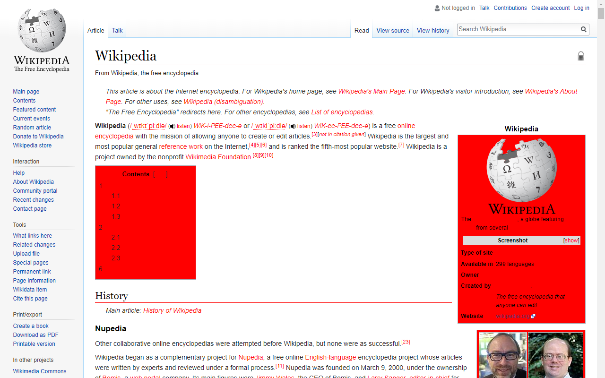
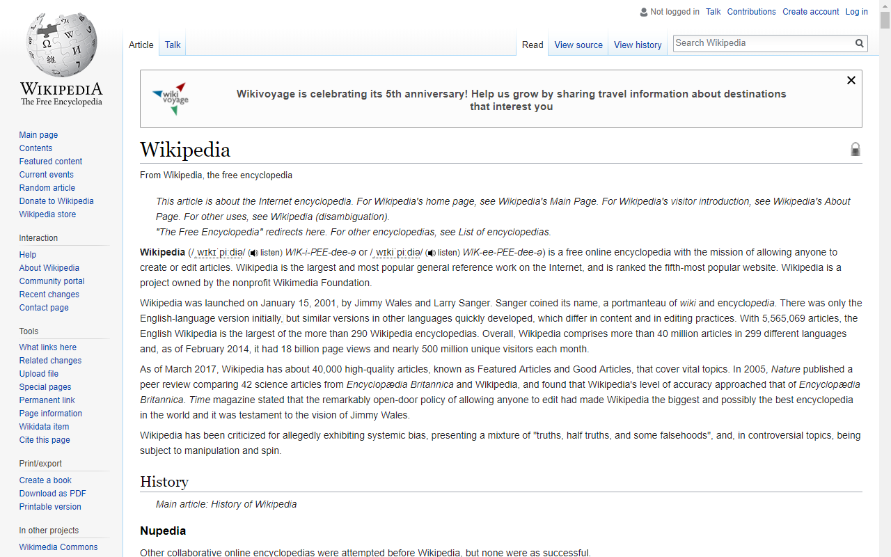
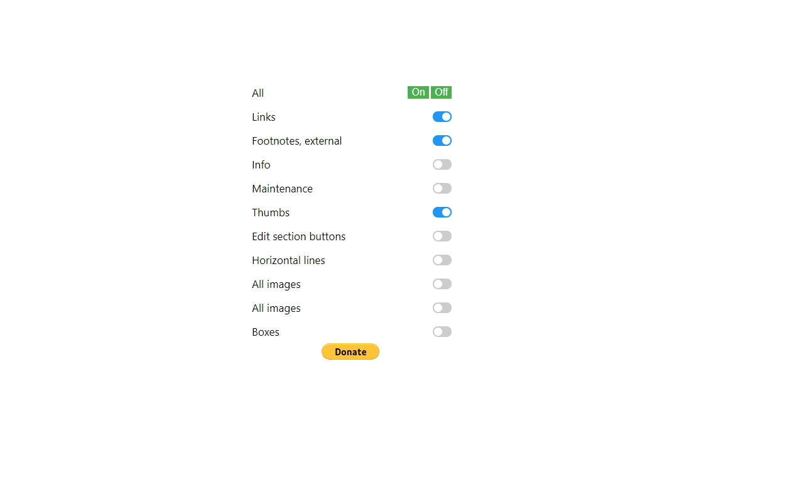

# ClearWiki

This extension will help you when copying text to all text editors. It removes footnotes, links, thumbs, images and so on from Wikipedia.

  
  
  

https://chrome.google.com/webstore/detail/clearwiki/oafjaeaegmcefaiepnoodekdoiomnfmp
